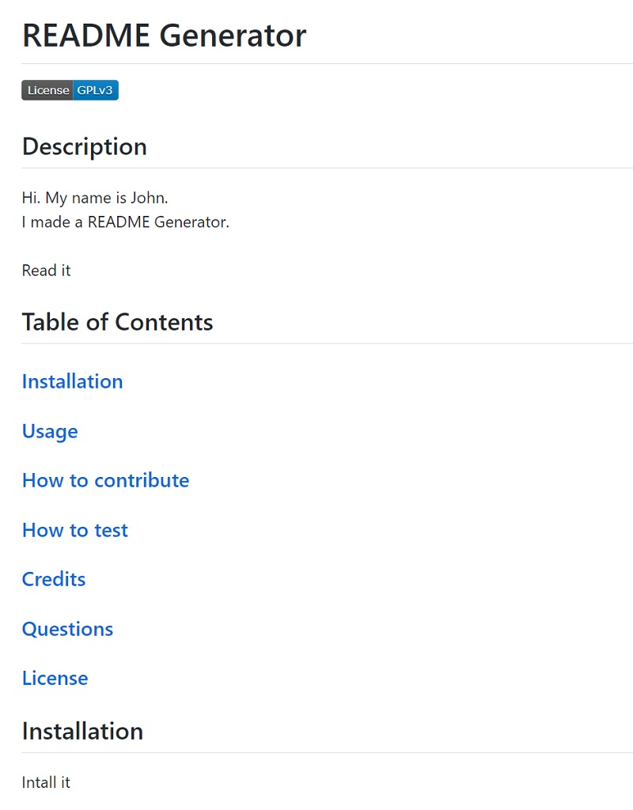
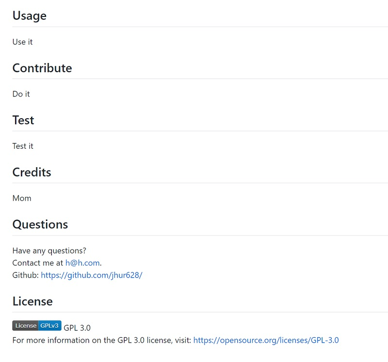
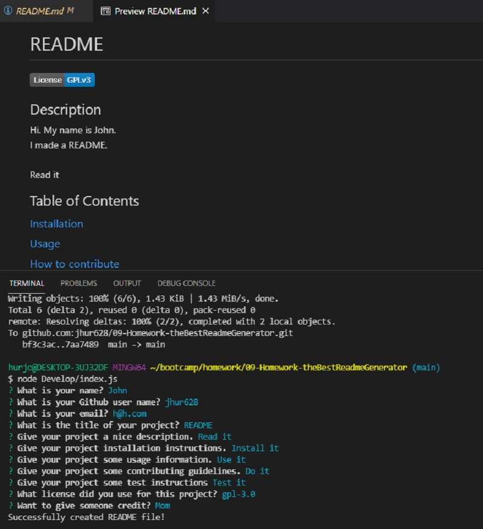

# The Best README Generator
 
  ## Description
  I made a README Generator.

  To start the generator, run the index.js on node. The user will prompted with questions. After the user has completed answering the prompts, A README file will be saved to the "Develop" folder. There are options to add a license which will add a badge onto the README file. The user also has the option to have no licenses, which will not add a badge to the READMe file. WHen the user adds their Github user name, a link of the the user's github will be added to the README file.

  The generator provides a section for description, installation, usage, contribution, testing, credits, and section with information of how to reach the user. There is also a functional table of contents that links to the respective sections.

  Enjoy.

  GitHub Repository: [https://github.com/jhur628/09-Homework-theBestReadmeGenerator](https://github.com/jhur628/09-Homework-theBestReadmeGenerator)
  
  Sample README file: [https://github.com/jhur628/09-Homework-theBestReadmeGenerator/blob/main/Develop/README.md](https://github.com/jhur628/09-Homework-theBestReadmeGenerator/blob/main/Develop/README.md)
  
  ## Table of Contents
  ### [Screenshots](##Screenshots)
  ### [Installation](##Installation)
  ### [Usage](##Usage)
  ### [Credits](##Credits)
  ### [Questions](##Questions)

  ## Screenshots
  
  
  
  ## Installation
  No installation required. Just run index.js on node.
  ## Usage
  This application will create a README file easily. The user just to needs to fill in the prompts and a README file will generate.
  ## Credits
  I thought this assignment was fairly straightforward until I had a study group with some of my peers. They helped me realize I was doing a part of the generator incorrectly, so I want to give a lot of credit to my peers.
  ## Questions
  Have any questions?  
  Contact me at hur.john628.com.  
  Github: https://github.com/jhur628/  